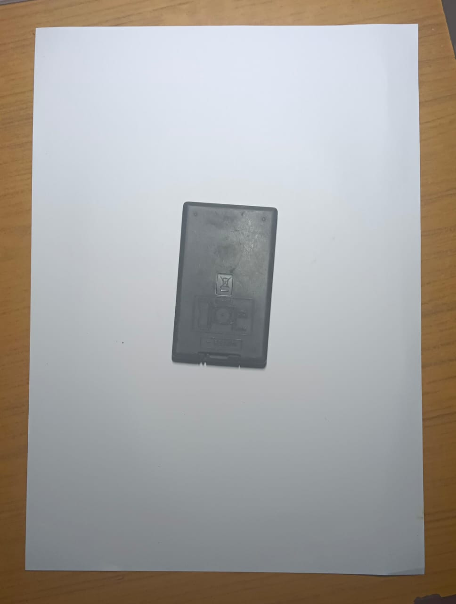

# Real-Time-Object-Measurement


## 📌 Overview  
This project utilizes **OpenCV** to measure object dimensions in real time using a **webcam** or a **local image**. It detects contours, applies **perspective transformation**, and overlays the object’s **height and width** in centimeters.  

---

## 📸 Example Output  

### 🔹 Original Input  
_(Replace with an actual image)_  
  

### 🔹 Processed Output with Measurements  
_(Replace with an actual image)_  
  

---

## 🔧 Features  
✅ Works with **Webcam & Local Images**  
✅ **Real-Time Measurement** & Object Detection  
✅ **Perspective Correction** for Accurate Scaling  
✅ **Measurement Overlay in cm**  

---

## 🛠️ Technologies Used  
- **Python** 🐍  
- **OpenCV** 🎥 (Image Processing & Contour Detection)  
- **NumPy** ➗ (Mathematical Computations)  

---

## 🚀 How It Works  

### 🔹 Step 1: Input Selection  
- The program asks the user:  
  ```
  Do you want to use the webcam? Choose 1 for webcam - 0 for local image:
  ```
- If **1** → The webcam is activated.  
- If **0** → The script loads an image from the local directory.  

📷 _Example of webcam feed_  
  

---

### 🔹 Step 2: Contour Detection  
- The image is converted to **grayscale**, blurred, and processed using **Canny edge detection** to find contours.  

📷 _Contours detected in the image_  
  

---

### 🔹 Step 3: Perspective Transformation  
- The largest detected object (e.g., A4 paper) is used as a reference.  
- The image is **warped** to correct for perspective distortion.  

📷 _Warped Image for precise measurement_  
  

---

### 🔹 Step 4: Measurement & Annotation  
- Object dimensions are computed using pixel-to-cm scaling.  
- Measurements are **annotated** on the output image.  

📷 _Final measurement overlay_  
  

---

## 📌 Installation & Usage  

### 1️⃣ Install Dependencies  
```bash
pip install opencv-python numpy
```  

### 2️⃣ Run the Script  
```bash
python ObjectMeasurement.py
```  

### 3️⃣ View Measurements  
- The processed image will display the **object's height & width** in centimeters.  
- Press **Esc** to exit.  

---

## 🔍 Customization  
- Modify `minArea` in `utlis.py` to detect different object sizes.  
- Adjust `scale` for accurate calibration.  
- Change `path` in `ObjectMeasurement.py` to use different images.  

---

## 🏆 Credits  
Developed by **Yashvardhan Singh** 🎯  

